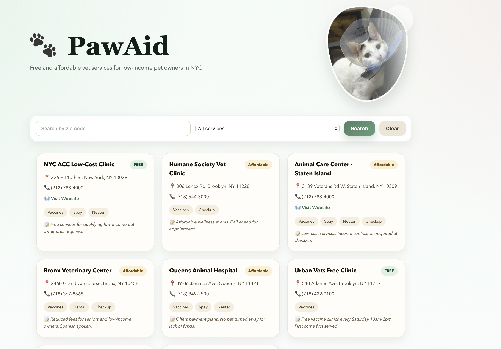
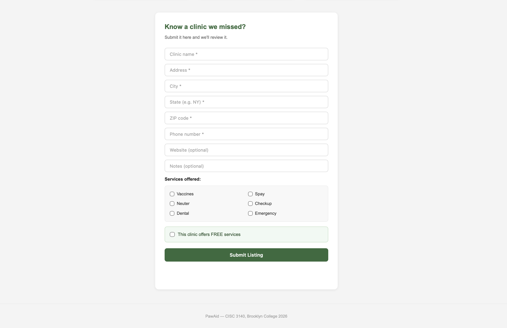

# PawAid 🐾
A web app that helps low-income pet owners find affordable or free vet services.
## Live App
👉 👉 https://paw-aid.vercel.app/
## Screenshots

## Tech
- Node.js, Express, MongoDB, Mongoose, Nodemon

## How to Run
1. Clone the repo
2. Run `npm install`
3. Create a `.env` file:
4. Run `npm run dev`
5. Visit `http://localhost:5001`

## API Routes
| Method | URL | What it does |
|--------|-----|--------------|
| GET | /api/vets | Get all listings |
| GET | /api/vets/:id | Get one listing |
| POST | /api/vets | Add a listing |
| PUT | /api/vets/:id | Update a listing |
| DELETE | /api/vets/:id | Delete a listing |

## Author
JYO — CISC 3140, Brooklyn College, Spring 2026
